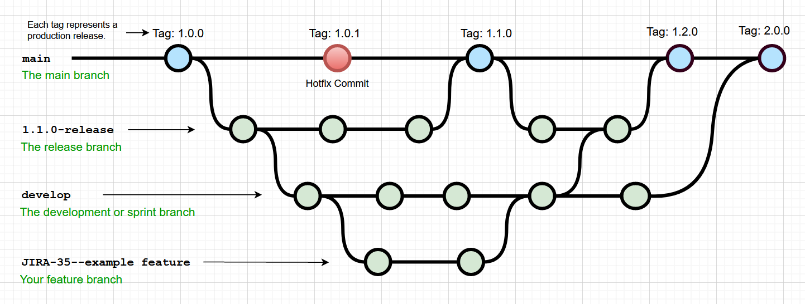

* **section:** Introduction to Git
* **title:** What is Git and Why is it Important?
* **description:** History of Git, advantages of using version control.

**Welcome to the first unit of our Git course!** 🚀 In this lesson, we will dive into the world of Git, exploring what it is and why it has become an indispensable tool for developers and teams around the globe.

#### What is Git?

Git is a distributed version control system, designed to handle everything from small to very large projects with speed and efficiency. It was created by Linus Torvalds in 2005 for the development of the Linux kernel, and since then, it has gained popularity in the development community due to its robustness, flexibility, and ability to facilitate workflow in complex collaborations.

{.m-1 .mx-auto .d-block style="max-width: 100%;"}

#### The Importance of Git

- **Version Control:** Imagine you're writing a document and want to save every significant change. Git allows you to do exactly that but with source code, ensuring you can review or revert to any previous version without losing data.
- **Collaboration:** Git is like a superpower for collaboration. It allows multiple people to work on the same project simultaneously without interfering with each other's work.
- **Change Tracking:** With Git, every change in the code is recorded. If something goes wrong, you can easily find and fix the mistake, knowing exactly which change caused it.

#### Practical Example

Imagine you're working on a website project with a team. One day, you decide to improve the homepage, while your teammate works on the contact section. Using Git, both of you can work on your respective tasks without interference, and then merge your changes without losing each other's work.

#### 🤔 Conclusion

Git is much more than just a simple version control system; it's a fundamental tool that facilitates project management, collaboration among developers, and efficient tracking of progress. By mastering Git, you not only improve your development skills but also equip yourself to contribute to projects of any scale, ensuring your work is secure and easily accessible to your team.

---

📚 **Sources Used:**
- [Pro Git Book](https://git-scm.com/book/en/v2), A comprehensive resource for learning Git from basics to advanced concepts.
- [GitHub Learning Lab](https://lab.github.com/), Offers hands-on courses to get familiar with Git and GitHub.
- [Git Documentation](https://git-scm.com/doc), The official Git documentation is a great resource to dive deeper into its commands and features.

---

With that, we conclude our first unit. I hope you're as excited as we are to embark on this journey towards mastering Git. Get ready for the next unit, where we'll set up our Git environment and make our first commit! 🌟