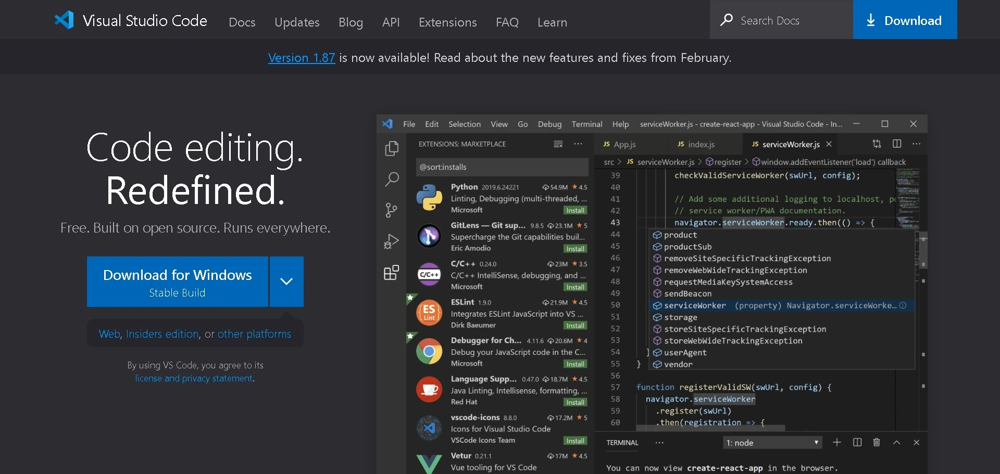
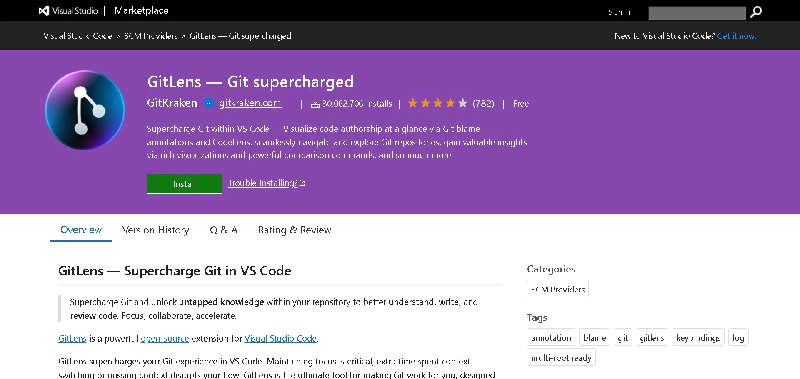
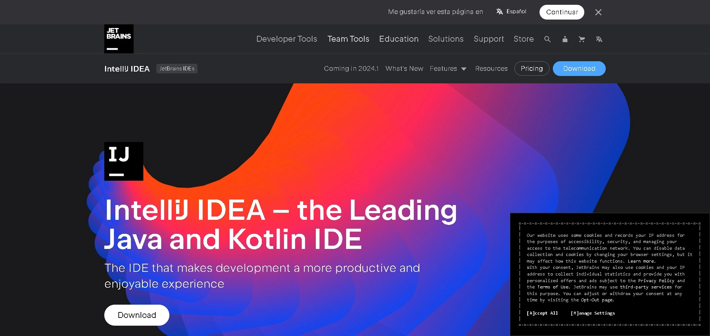

* **section:** Tools and Git Extensions
* **title:** Git Integration with IDEs
* **description:** Using Git within editors like Visual Studio Code, IntelliJ.

**Greetings, builders of digital worlds!** 🌍💻 At the crossroads where the art of programming meets the magic of version control, emerges a powerful alliance: the integration of Git with our favorite Integrated Development Environments (IDEs). In this unit, we will explore how [Visual Studio Code (VS Code)](https://code.visualstudio.com/) and [IntelliJ](https://www.jetbrains.com/idea/), two of the most renowned spell workshops in the realm of software development, allow us to invoke the powers of Git directly from the comfort of our magical creation spaces. Get ready to unveil the synergy between Git and your IDEs, thus enhancing your fluency and effectiveness in managing enchanted code. **Let the integration begin!**

#### Visual Studio Code: The Magical Workshop 🧙‍♂️📖

[Visual Studio Code (VS Code)](https://code.visualstudio.com/) is not only known for its adaptability and extensive capabilities through extensions but also for its native integration with Git. Here's how to make the most of this collaboration:

{.m-1 .mx-auto .d-block style="max-width: 100%;"}

1. **Built-in Version Control**: Right within VS Code, you can commit changes, view differences, switch branches, and more, all without leaving your editor.

2. **Command Palette**: Use `Ctrl+Shift+P` (or `Cmd+Shift+P` on Mac) to open the Command Palette, where you can execute Git commands by typing `Git: ` followed by the action you want to perform.

3. **Extensions to Empower Git**: While VS Code has native support for Git, exploring extensions like [GitLens](https://marketplace.visualstudio.com/items?itemName=eamodio.gitlens) can further enrich your experience, offering detailed insights and granular control over your Git history.

{.m-1 .mx-auto .d-block style="max-width: 100%;"}

#### IntelliJ IDEA: The Guild of Wizards 🧙‍♀️🔮

[IntelliJ IDEA](https://www.jetbrains.com/idea/), on the other hand, provides an environment where the magic of Java (and other languages) and Git flow effortlessly together. Let's see how this IDE handles version control:

{.m-1 .mx-auto .d-block style="max-width: 100%;"}

1. **Version Control Window**: IntelliJ incorporates a dedicated 'Version Control' window, allowing you to review file changes, commit history, and manage branches with just a few clicks.

2. **Git Operations in the Menu**: From the `VCS` menu, you have access to all Git operations you might need, from committing changes to managing branches and resolving merge conflicts.

3. **Support for Git Flow**: For teams using Git Flow, IntelliJ offers integrated support through its Git Flow plugin, making it easy to track this methodology directly from the IDE.

#### Tips for Effective Integration 📚✨

- **Customize Your Workflow**: Both VS Code and IntelliJ allow for extensive customization. Take the time to configure your environment according to your preferences and project needs.

- **Use Keyboard Shortcuts**: Learn and use keyboard shortcuts for common Git operations in your IDE. This can save a lot of time and increase your efficiency.

- **Keep Your IDEs and Extensions Updated**: Continuous improvements mean that both built-in Git features and those offered by extensions become more powerful and user-friendly. Keeping your environment updated ensures you make the most of these tools.

#### 🤔 Conclusion

The integration of Git with IDEs like Visual Studio Code and IntelliJ IDEA transforms the way we interact with our code and teams. These powerful environments not only facilitate code writing but also allow us to manage its evolution with grace and efficiency. By mastering these tools, we better equip ourselves to tackle the challenges of collaboration and version control in the modern era of software development.

---

📚 **Sources Used:**

- [VS Code - Version Control](https://code.visualstudio.com/docs/editor/versioncontrol)
- [IntelliJ IDEA - Version Control with IntelliJ IDEA](https://www.jetbrains.com/help/idea/version-control-integration.html)

---

By the end of this unit, you'll be well-prepared to integrate Git with your favorite IDEs, thus enhancing your fluency and effectiveness in managing enchanted code. Get ready for the next unit, where we'll explore visualization and analysis tools for Git! 🌟