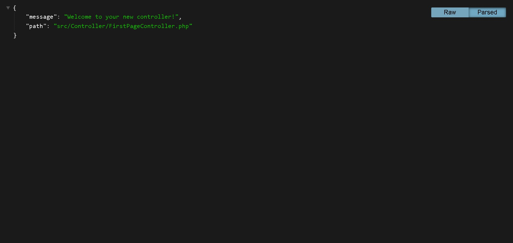

accedo a la carpeta del proyecto, y levanto el contenedor con:

```bash
$ docker compose up -d
```

entro dentro del contenedor de php:

```bash
$ docker exec -ti symfony_php bash
# composer install
```

Dentro del contenedor ejecuto el siguiente comando para instalar dependencias de PHP:

```bash
# composer install
```

Ahora puedo usar [MakerBundle](https://symfony.com/bundles/SymfonyMakerBundle/current/index.html), que es un conjunto de comandos para generar código repetitivo, como controladores, entidades, formularios, etc.

> En este caso crearemos una primera página.

```bash
# php bin/console make:controller FirstPageController
```

Al ejecutarlo me devuelve el siguiente mensaje:

```bash
                                                                                                                                             
  There are no commands defined in the "make" namespace.                                                                                     
                                                                                                                                             
  You may be looking for a command provided by the "MakerBundle" which is currently not installed. Try running "composer require symfony/ma  
  ker-bundle --dev".  
```

> Este mensaje es porque no tengo instalado el paquete `symfony/maker-bundle`, así que lo instalo con:

```bash
# composer require symfony/maker-bundle --dev
```

Vuelvo a lanzar el comando para generar una nueva página:

```bash
# php bin/console make:controller FirstPageController
```

Obteniendo el siguiente mensaje:

```bash
# php bin/console make:controller

 Choose a name for your controller class (e.g. OrangePopsicleController):
 > FirstPageController

 created: src/Controller/FirstPageController.php

  Success! 
           
 Next: Open your new controller class and add some pages!
```

Ahora puedo acceder a la página que he creado en [http://localhost:80/first/page](http://localhost:80/first/page).

Y podré ver algo como esto:

